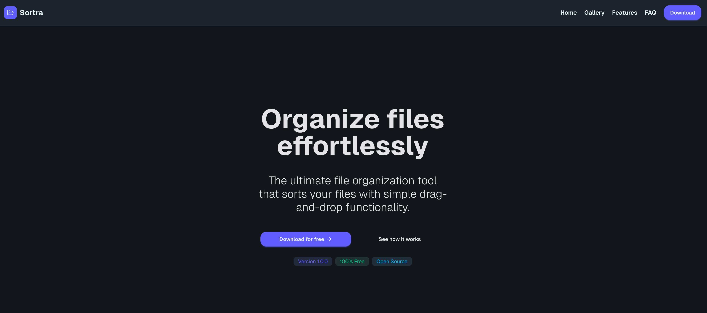
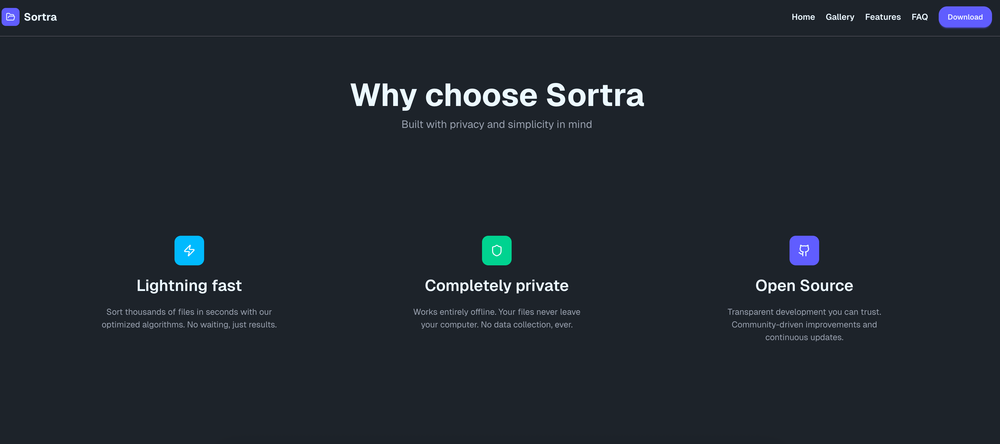
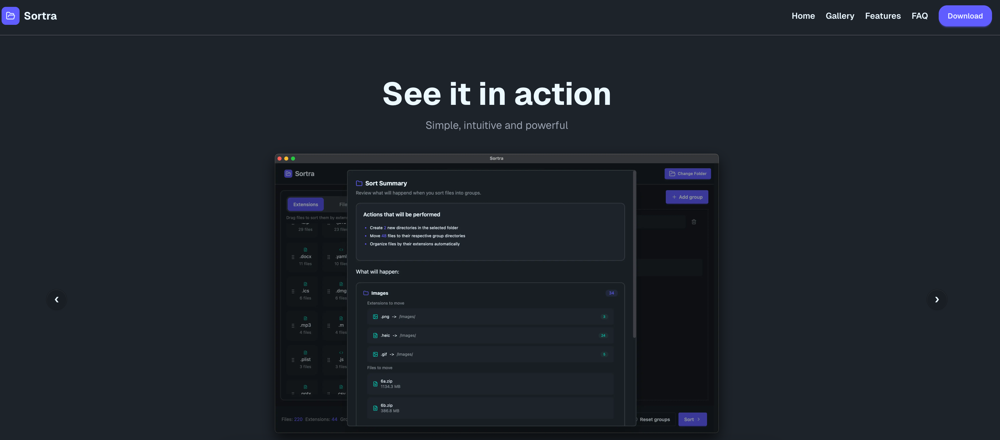
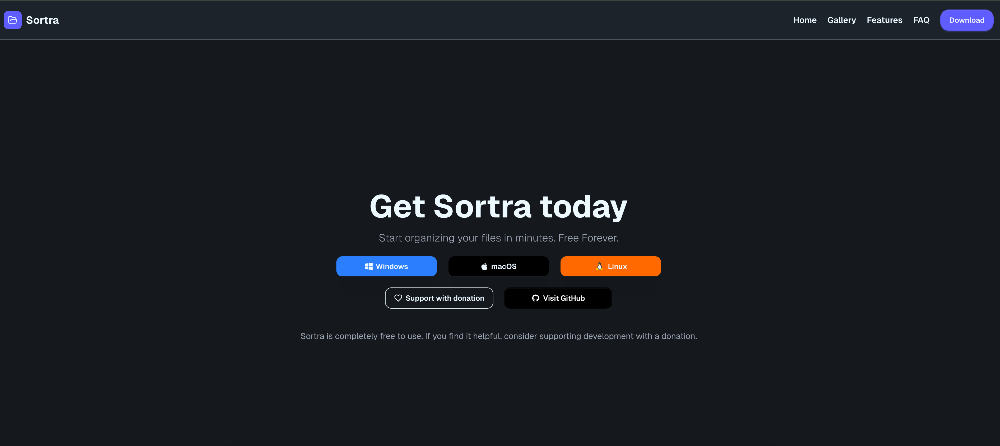
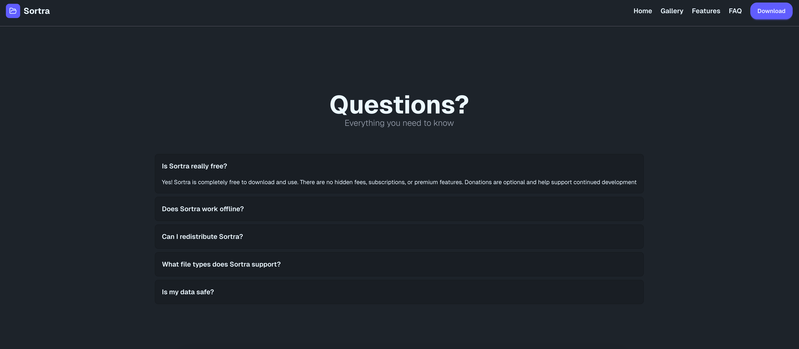

# Sortra Web 🌐

**Sortra Web** is the official landing page for [Sortra](https://github.com/Schoji/Sortra) – a fast, cross-platform file organization tool built with Tauri and React.  
This website is built with **Next.js**, **Tailwind CSS**, **DaisyUI**, and **Framer Motion** to deliver a beautiful, snappy and responsive user experience.

---

## ✨ Features

- 💻 **Cross-platform download support** for Windows, macOS and Linux
- 🎨 **Modern UI** powered by Tailwind CSS + DaisyUI
- 🎞️ **Smooth animations** with Framer Motion
- 🧭 Full-screen **scroll-snap** layout with sections
- 💖 Integrated **PayPal donation** button
- 📥 **Download modals** with OS icons and hover effects
- 📸 **Screenshot gallery** to showcase the app
- ❓ Interactive **FAQ accordion** section
- 📜 Clear **disclaimer & license** for end users

---

## 📸 Screenshots

> Here's what Sortra Web looks like:

### 🖼️ Hero Section

### 📂 Why choose Sortra

### 📸 Screenshot Gallery

### 💻 Download Section

### ❓ FAQ Section

---

## ⚖️ License

This project is released under a **custom license**:

> You are free to modify the code for personal use.  
> However, **redistribution or public publishing (in any form)** is **not permitted** without **explicit permission** from the author.

---

## 🧩 Built With

- [Next.js](https://nextjs.org/)
- [Tailwind CSS](https://tailwindcss.com/)
- [DaisyUI](https://daisyui.com/)
- [Framer Motion](https://www.framer.com/motion/)

---

## ❤️ Support Development

Sortra Web and the Sortra app are completely free.  
If you find them useful, consider supporting development with a donation:

👉 [Donate via PayPal](https://www.paypal.com/donate/?hosted_button_id=NS5B4E326KRYE)
